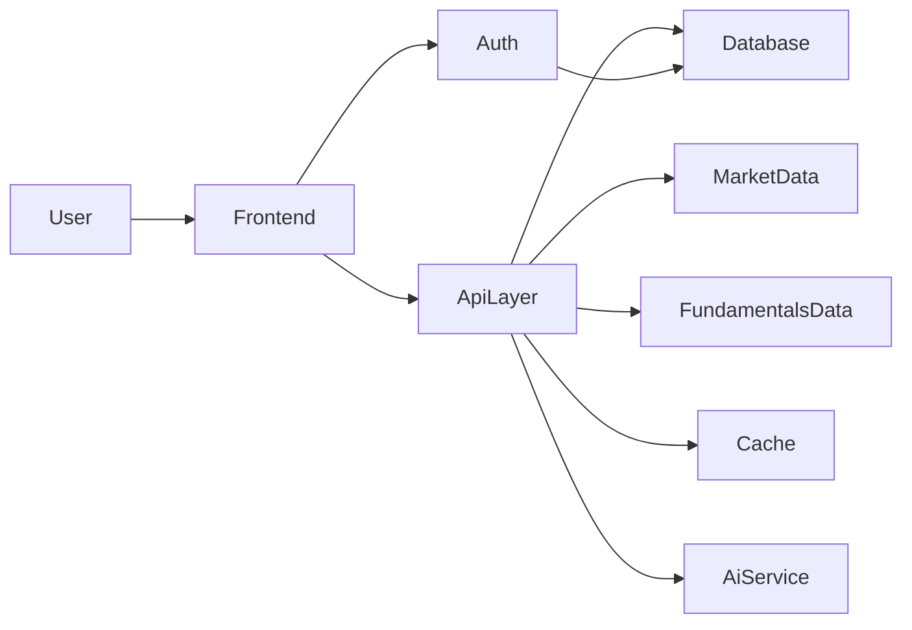

# Product Requirements Document

## Product
Intrinsic Value Calculator MVP

## Document Purpose
This document defines the MVP requirements for a desktop web application that helps retail traders evaluate whether a US-listed stock is overvalued or undervalued using a blended intrinsic value estimate. The MVP is intended for product validation, not full market coverage or institutional-grade portfolio management.

## Problem
Retail traders often make decisions based on market sentiment, short-term price action, and fragmented financial information rather than a disciplined view of underlying business value. Beginners in particular struggle to answer a basic question: "Is this stock currently trading below or above its reasonable intrinsic value?"

The application solves this by providing a simplified stock analysis experience that combines:
- Discounted Cash Flow (DCF) valuation
- Relative valuation
- A single blended intrinsic value estimate
- Supporting financial metrics, long-term trends, and AI-generated qualitative insight

The goal is to help users make more informed decisions quickly, without requiring them to manually build valuation models or read raw filings.

### Product Goal
Validate demand for a user-friendly intrinsic value analysis tool for US-listed equities that users can trust for quick first-pass research.

### MVP Scope
- Desktop web application only
- US-listed equities only
- Google login required for all users
- End-of-day pricing only
- Annual financial data only, up to 10 years of history
- Single-stock analysis experience
- Saved watchlist and holdings per authenticated user
- One blended intrinsic value shown on the stock page

### Non-Goals For MVP
- Mobile app or mobile-first optimization
- ETFs, crypto, international equities, or mutual funds
- Real-time or intraday market data
- User-editable valuation assumptions
- Side-by-side stock comparison
- News-driven analysis
- Social features, alerts, admin tooling, or advanced analytics dashboards
- Monetization features

## Users

### Primary User Segment
Retail traders from beginner to intermediate skill level who want a simple, reliable way to evaluate whether a stock appears undervalued or overvalued before buying or holding it.

### User Characteristics
- Familiar with stock tickers such as `AAPL` or `MSFT`
- Understand basic investing concepts, but may not know how to build a valuation model
- Want a fast answer with supporting evidence, not a spreadsheet-heavy workflow
- Value clarity, trust, and explainability over exhaustive professional tooling

### Primary User Needs
- Quickly search a stock and reach a clear valuation summary
- Understand the relationship between current market price and intrinsic value
- Review a small set of important financial metrics and long-term trends
- Read concise qualitative analysis that frames upside, downside, and moat strength
- Save interesting stocks and personal holdings for future review

## Features

### 1. Search And Discovery
Users must be able to search by ticker and company name using autocomplete.

#### Functional Requirements
- Provide a prominent search bar in the top navigation/header area.
- Support ticker symbol matches and company name matches.
- Return autocomplete suggestions as the user types.
- Selecting a result opens the stock details page for that symbol.
- Search should prioritize exact ticker matches above fuzzy company-name matches.

#### UX Expectations
Based on the reference UI images, the search experience should feel like the entry point into a stock research dashboard, not a generic list page.

### 2. Stock Details Page
The stock details page is the core MVP experience.

#### Functional Requirements
- Display company name, ticker, exchange, and sector/industry when available.
- Display current end-of-day market price.
- Display one blended intrinsic value in USD.
- Show a valuation status label based on the gap between intrinsic value and market price.
- Show the percentage gap between intrinsic value and current market price.
- Show a concise disclaimer that the output is informational and not financial advice.

#### Recommended Valuation Rating Bands
- `Significantly Undervalued`: intrinsic value is more than 20% above market price
- `Undervalued`: intrinsic value is 10% to 20% above market price
- `Fairly Valued`: intrinsic value is within +/-10% of market price
- `Overvalued`: intrinsic value is more than 10% below market price

These bands are recommended because they are easy for beginner users to understand while still allowing the product to communicate confidence ranges rather than false precision.

#### UX Expectations
The stock page should closely follow the attached reference direction:
- Dashboard-style two-column layout
- A top summary area with company identity, market price, intrinsic value, and valuation status
- Tabbed or segmented sections such as `Overview`, `Financials`, `Intrinsic Value`, and `Chart`
- A clean, premium retail-investing visual style that emphasizes readability and trust

### 3. Fundamental Analysis Section
Users must be able to review key metrics that explain the valuation at a glance.

#### Required Metrics
- Price-to-Earnings (`P/E`)
- Price/Earnings-to-Growth (`PEG`)
- Free Cash Flow (`FCF`)
- Return on Equity (`ROE`)
- Revenue growth

#### Functional Requirements
- Show each metric in a structured summary card/grid.
- Display the latest available annual values.
- Include short helper text or labels where a metric may be unclear for beginners.
- Handle missing or negative values gracefully rather than showing broken states.

### 4. AI-Generated Insights
AI insight should help users interpret the numbers, not replace the valuation model.

#### Required Outputs
- Short company summary
- Bull thesis
- Bear thesis
- Economic moat explanation

#### Moat Presentation
- Show moat strength as a label, not a raw score
- Initial labels: `Weak`, `Moderate`, `Strong`

#### Functional Requirements
- Generate insights on demand when the user opens a stock page.
- Use company profile, financial trends, and other online data available to the system, excluding recent news.
- Present output in concise sections with clear headings.
- Include a warning that AI-generated content may be imperfect or incomplete.

#### UX Expectations
Insights should read like an assistant to the user, not a chatbot conversation. The copy should be concise, structured, and grounded in observable business and financial context.

### 5. Financial Visualizations
Users need historical context to understand whether the valuation is supported by long-term business performance.

#### Required Charts
- Revenue, annual, up to 10 years
- Free cash flow, annual, up to 10 years
- Net income, annual, up to 10 years
- Small historical price chart

#### Functional Requirements
- Show line or bar visualizations for annual trends.
- Use simple, readable axis labels and consistent units.
- Ensure all visualizations load quickly and support empty or partially missing data.
- The price chart should provide recent historical context but does not need advanced technical-analysis tooling in MVP.

### 6. Watchlist And Holdings
Authenticated users must be able to save both stocks they are monitoring and stocks they own.

#### Watchlist Requirements
- Add stock to watchlist from the stock page
- Remove stock from watchlist
- View watchlist as a simple saved list

#### Holdings Requirements
- Add a holding with:
  - Symbol
  - Share count
  - Average cost basis
- Edit or delete a holding
- Show current gain/loss based on current end-of-day market price only

#### Out Of Scope
- Transaction history
- Tax lots
- Realized gains
- Portfolio analytics beyond basic holding status
- Intrinsic value gap column in the portfolio table

### 7. Authentication
The MVP requires users to log in before using the app.

#### Functional Requirements
- Support Google sign-in
- Require authentication before stock analysis pages and saved portfolio features are accessible
- Persist authenticated user sessions securely
- Associate watchlist and holdings data with the logged-in user account

## User Flows

### Flow 1: New User Sign-In
1. User lands on the application home page.
2. User clicks `Continue with Google`.
3. User completes OAuth authentication.
4. User is redirected into the main app experience.

### Flow 2: Search And Analyze A Stock
1. User enters a ticker or company name in the search bar.
2. Autocomplete suggestions appear.
3. User selects a stock.
4. User lands on the stock details page.
5. User reviews:
   - Market price
   - Blended intrinsic value
   - Valuation label
   - Core fundamentals
   - AI summary, bull thesis, bear thesis, and moat explanation
   - Historical charts

### Flow 3: Save To Watchlist
1. User views a stock details page.
2. User clicks `Add to watchlist`.
3. Stock is saved to the authenticated account.
4. User can later access the watchlist from a portfolio or saved-items view.

### Flow 4: Add A Holding
1. User views a stock details page or portfolio area.
2. User adds a holding with symbol, share count, and average cost basis.
3. The app stores the holding in the user's account.
4. The holdings table displays current market value and unrealized gain/loss based on current end-of-day price.

## Technical Considerations

### Recommended Architecture
For MVP, use a lightweight serverless architecture that minimizes operational overhead while supporting public traffic and authenticated user storage.

#### Recommended Stack
- Frontend: `React + TypeScript + Vite`
- Hosting: `Vercel`
- Backend/API layer: `Vercel Functions` or `Vercel serverless API routes`
- Authentication: `Supabase Auth` with Google OAuth
- Database: `Supabase Postgres`
- Caching: `Upstash Redis` or Vercel-managed edge/server cache
- Scheduled refresh jobs: `Vercel Cron`
- AI orchestration: server-side AI wrapper behind the backend API, provider left as an open decision

This stack aligns with the product's MVP goals because it is fast to ship, inexpensive to operate early on, and suitable for a public desktop web app with moderate traffic.

### High-Level System Flow

### Backend Responsibilities
The backend should own:
- Stock search aggregation
- Price and financial data normalization
- Intrinsic value calculation
- Valuation band classification
- AI prompt construction and output sanitization
- Cache control and freshness policy
- Watchlist and holdings persistence
- Rate limiting and abuse protection

### Recommended Data Strategy
Yahoo Finance and Google Finance are useful references for expected coverage and UX, but they should not be treated as guaranteed official backend APIs for a production-oriented MVP.

#### Recommended MVP Approach
Use a hybrid data strategy:
- Primary market/fundamentals API: a free or low-cost developer-friendly provider with broad US equity support
- Supplemental official source: `SEC EDGAR` for annual filings and company fundamentals validation
- Optional fallback provider: a second free API for quotes or search resilience

#### Recommended Provider Direction
- `Financial Modeling Prep`, `Finnhub`, or `Alpha Vantage` are practical MVP candidates to evaluate
- `SEC EDGAR` should be used where possible to increase trust in annual financial data
- Keep the provider abstraction inside the backend so migration to a paid provider later does not require frontend rewrites

#### Data Provider Recommendation
For MVP, the most practical path is:
1. Use one free API provider for stock search, profile, price history, and key metrics
2. Use `SEC EDGAR` as a verification and enrichment source for annual fundamentals where feasible
3. Normalize all provider responses into one internal stock-analysis schema

### Recommended Valuation Methodology

#### DCF Recommendation
Use a simplified automated two-stage DCF designed for speed, consistency, and beginner trust.

Recommended logic:
- Start with trailing free cash flow when available
- Estimate a 5-year growth path using a blend of:
  - historical revenue growth
  - historical free cash flow trend
  - profitability stability guardrails
- Cap aggressive growth assumptions to prevent unrealistic valuations
- Apply a standard discount rate for MVP
- Apply a conservative terminal growth rate
- Convert to per-share equity value using cash, debt, and shares outstanding when available

Recommended default assumptions for MVP:
- Forecast horizon: 5 years
- Discount rate: 10%
- Terminal growth rate: 2.5%
- Guardrails: cap projected growth and decline bands to reduce extreme outliers

This approach is more MVP-friendly than a highly customizable model because it is easier to explain, easier to test, and more consistent across stocks.

#### Relative Valuation Recommendation
Use a rules-based blend of company historical multiples and sector/industry reference multiples.

Recommended logic:
- For profitable companies, prioritize `P/E` and price-to-free-cash-flow style comparisons
- For companies with unstable earnings, fall back toward revenue-based comparisons
- Blend:
  - historical company valuation range
  - sector or industry median multiples
- Apply simple quality guardrails using growth and profitability context

This gives users a practical market-relative anchor without requiring manually selected comparable companies in MVP.

#### Blended Intrinsic Value
Final intrinsic value shown to the user:
- `50% DCF valuation`
- `50% relative valuation`

Only the blended number should be shown in the MVP UI to preserve simplicity, while the backend may retain component values for debugging and future iteration.

### Performance And Freshness
Speed and perceived trust are core MVP requirements.

#### Performance Requirements
- Initial page load should feel fast on desktop broadband connections
- Search suggestions should return quickly enough to feel interactive
- Stock detail pages should prioritize cached responses for commonly viewed symbols

#### Recommended Caching Strategy
- Search results cache: short-lived cache, for example 1 to 6 hours
- End-of-day price cache: refresh daily after market close
- Annual fundamentals cache: refresh daily or when a refresh job detects new filings
- AI insights cache: cache per stock for a longer period, such as 1 to 7 days, unless a financial-data refresh invalidates the record

#### Recommended Freshness Policy
- Price data: once daily refresh is acceptable for MVP
- Fundamentals: daily refresh with longer retention because annual data changes infrequently
- Valuation output: recompute when underlying price or financial inputs change

### Security And Privacy
The MVP must be safe enough for public access even though it is not a brokerage platform.

#### Security Requirements
- Use secure Google OAuth flows
- Store secrets only on the server
- Prevent direct client exposure of provider API keys
- Validate all user input on the backend
- Apply rate limiting to search and stock-analysis endpoints
- Sanitize AI prompts and responses before rendering
- Use row-level access controls or equivalent user-level data protection for watchlist and holdings

#### Privacy Requirements
- Store only necessary user account and portfolio information
- Avoid collecting unnecessary personal data
- Provide a clear privacy policy before public launch

### Compliance, Risk, And Trust
Because this product deals with financial interpretation, trust and disclosure are product requirements, not optional legal polish.

#### Required Product Disclosures
- `Not financial advice`
- Market data may be delayed or end-of-day only
- AI-generated explanations may contain mistakes or incomplete reasoning
- Data coverage and calculations depend on third-party sources

#### Additional Risk Areas To Acknowledge
- Data licensing and usage restrictions vary by provider
- Free API availability and rate limits may impact reliability
- Some company data may be incomplete, stale, or inconsistent across providers

### Deployment And Scalability

#### Deployment Recommendation
- Deploy frontend to `Vercel`
- Deploy backend APIs as `Vercel Functions`
- Use `Supabase` for authentication and relational data storage
- Add `Upstash Redis` or equivalent managed cache for popular stocks and AI output

#### Scalability Guidance
- Keep backend endpoints stateless
- Cache normalized stock payloads aggressively
- Separate data-fetching logic from valuation logic behind internal service layers
- Add provider fallback support over time
- Preserve the option to move heavy valuation or AI generation jobs to async workers in later phases

### Observability
Even without a formal admin panel, the technical stack should support:
- Error logging
- API failure monitoring
- Cache hit/miss visibility
- Basic uptime and latency monitoring

This is recommended for engineering operations, not as a user-facing MVP feature.

### Assumptions
- Users are comfortable signing in with Google before using the product
- End-of-day pricing is sufficient for the initial validation goal
- Annual financial statements are enough to support first-pass intrinsic value decisions
- Users prefer a single blended valuation number over a more advanced breakdown in MVP
- Desktop-first usage is acceptable for the first release

### Open Decisions
- Final AI provider and model selection
- Exact online sources used for moat and qualitative business-context enrichment beyond fundamentals and company profile
- Final source of sector and peer classification used by the relative valuation engine
- Exact fallback data provider configuration
- Long-term migration path from free data providers to a more stable paid provider
- Final wording and placement of legal disclaimers in the UI

## Success Metrics
The primary success criterion for the MVP is user trust in the valuation output.

### Primary Success Metric
- Users consistently reach and engage with stock detail pages that present a complete intrinsic value analysis without obvious data-quality issues

### Supporting Success Metrics
- Percentage of searched symbols that successfully resolve to a usable stock analysis page
- Percentage of stock pages that return valuation output without missing critical data
- Repeat usage by authenticated users returning to saved watchlist or holdings
- Low frequency of broken data states, stale symbols, or failed AI insight generation
- Qualitative user feedback indicating the analysis feels understandable and credible

### MVP Validation Questions
- Do users trust the blended valuation enough to use it as part of their research workflow?
- Do users understand why a stock is labeled undervalued or overvalued?
- Do users find the AI explanation useful rather than distracting?
- Is the data quality strong enough to support public MVP usage without frequent manual intervention?
